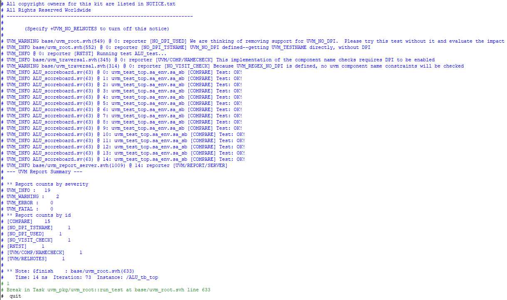

# UVM testbenching
# ALU decoder for a RISC-V processor

## Overview
The following code was written as a first attempt at UVM methodology, It hosts methods found in the tutorial (also in this repo), and was changed accordingly to perform the ncessary verification on an ALU decoder. Although purely combinational, this testbench was a start for futher UVM verification. 

This project was chosen a move to verifying direct computer hardware. 

## Progress 
The above UVM testbench was designed to verify a simple combinational ALU. The simulation of the code was a success as seen below. 

At first, dealing with Questa Macro file management was difficult to grasp, but the above photo shows that the testbench showed 2 warnings (mostly dealing with the command used for sim) and 0 errors which is a success! 

Written by Drake Gonzales 2/2/26

